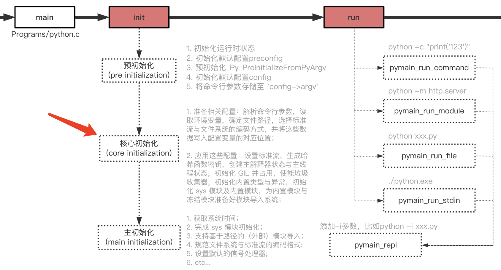

# GIL - 全局解释器锁(Global Interpreter Lock)

GIL的全称是Global Interpreter Lock(全局解释器锁)，来源是python设计之初，为了数据安全考虑所做的设计；

GIL保证（或者说限制）当前python解释器（interpreter）中同一时间只有一个线程在执行字节码。

## GIL的初始化

GIL的初始化过程，是在python解释器启动后的**核心初始化(core initialization)**阶段进行：


具体逻辑在文件 **Python/pylifecycle.c** 中的函数 **PyEval_InitThreads** ：
```c
void
PyEval_InitThreads(void)
{
    ...
    create_gil(gil);
    PyThreadState *tstate = _PyRuntimeState_GetThreadState(runtime);
    take_gil(ceval, tstate);
    ...
    }
}
```
当前主线程会先创建gil（create_gil），然后占用它（take_gil）。

## python的线程


