# Python解释器（interpreter）执行流程

## 1. 整体流程

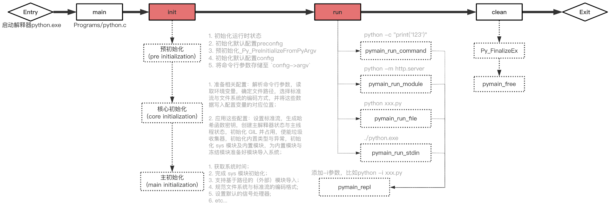

## 2. 初始化流程

略。见上图

## 3. 解释器执行流程

执行过程涉及对象关系：
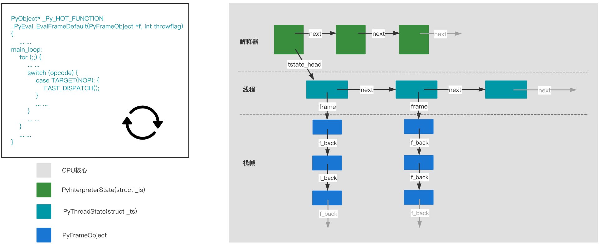

有多种执行模式（入口）：
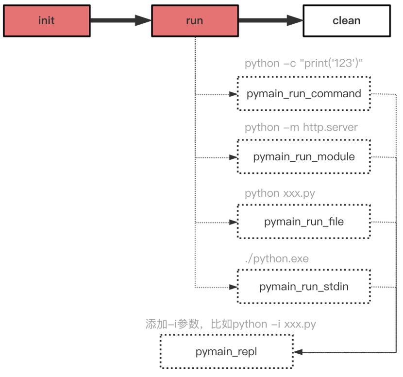

执行流程：
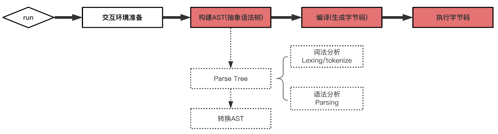

接下来按流程分阶段解析。

### 3.1 构建抽象语法树AST

#### 3.1.1 构建 Parse Tree 之 tokenize
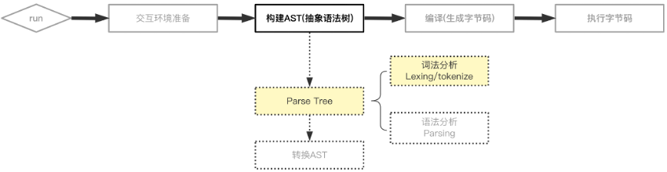

通过CPython提供的python标准库模块 `tokenize`，可以观察parse tree的词法分析过程。

假设有一个python脚本，test.py：
```shell
% vim test.py

> a + 1
```

然后执行命令对其进行词法分析：
```shell
% python3 -m tokenize test.py

0,0-0,0:            ENCODING       'utf-8'        
1,0-1,1:            NAME           'a'            
1,2-1,3:            OP             '+'            
1,4-1,5:            NUMBER         '1'            
1,5-1,6:            NEWLINE        '\n'           
2,0-2,0:            ENDMARKER      ''
```

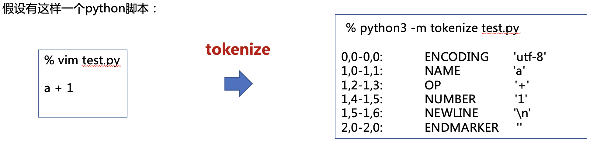

#### 3.1.2 构建 Parse Tree 之 Parsing

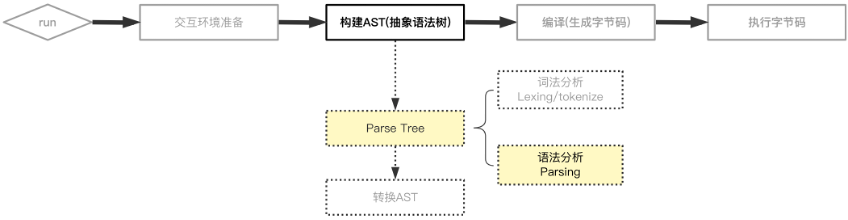

通过CPython提供的python标准库模块 `parser`，可以观察parse tree的语法分析过程。

同样观察 `a + 1` 这个表达式的处理过程：
```python
from pprint import pprint
import parser
st = parser.expr('a + 1')
pprint(parser.st2list(st))
```

得到语法分析结果：
```text
[258,
 [332,
  [306,
   [310,
    [311,
     [312,
      [313,
       [316,
        [317,
         [318,
          [319,
           [320,
            [321, [322, [323, [324, [325, [1, 'a']]]]]],
            [14, '+'],
            [321, [322, [323, [324, [325, [2, '1']]]]]]]]]]]]]]]]],
 [4, ''],
 [0, '']]
```

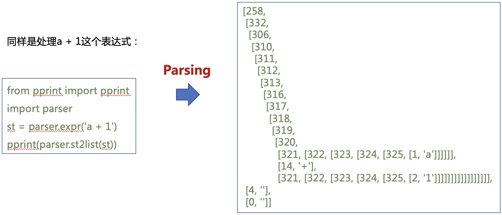

可以使用 `symbol(Lib/symbol.py)` 和 `token(Include/token.h)` 模块中的数字定义进行替换，得到：
```text
['eval_input',
 ['testlist',
  ['test',
   ['or_test',
    ['and_test',
     ['not_test',
      ['comparison',
       ['expr',
        ['xor_expr',
         ['and_expr',
          ['shift_expr',
           ['arith_expr',
            ['term',
             ['factor', ['power', ['atom_expr', ['atom', ['NAME', 'a']]]]]],
            ['PLUS', '+'],
            ['term',
             ['factor',
              ['power', ['atom_expr', ['atom', ['NUMBER', '1']]]]]]]]]]]]]]]]],
 ['NEWLINE', ''],
 ['ENDMARKER', '']]
```

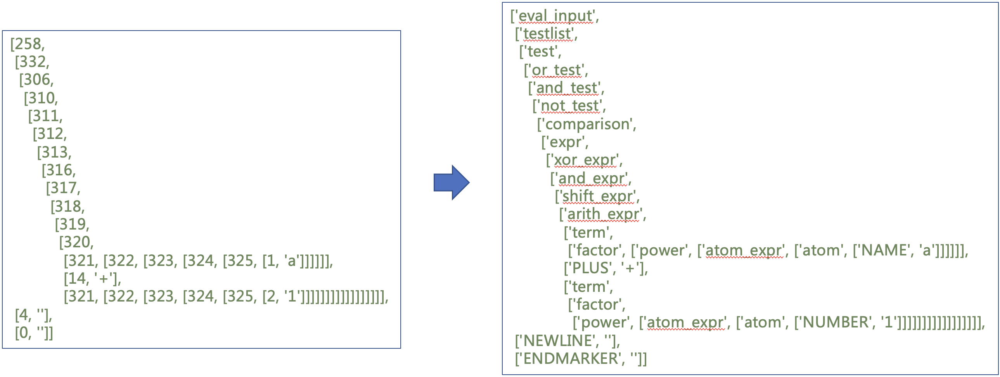

该 `Parse Tree` 整理为更直观的树形结构如下：
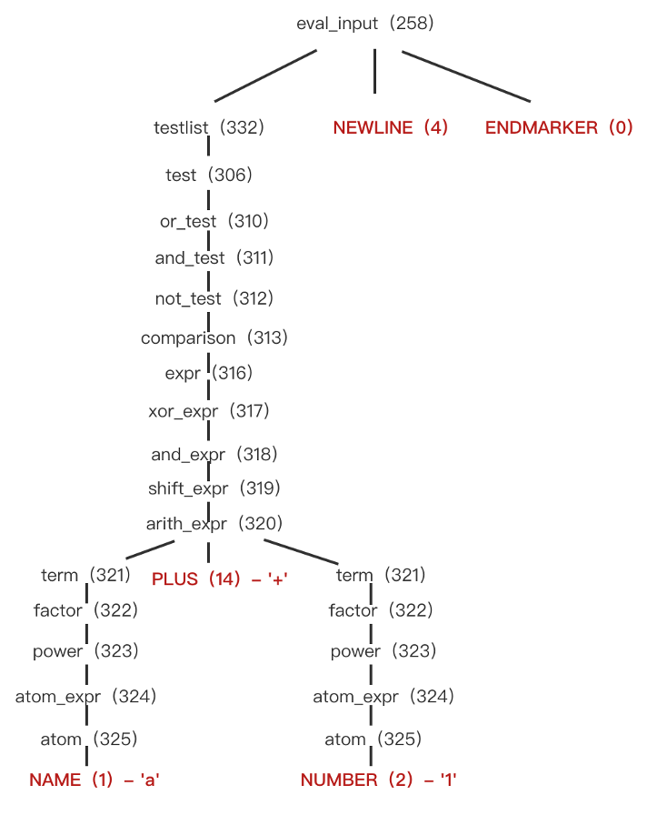

#### 3.1.3 Parse Tree 转换为 Abstract Syntax Tree(AST)

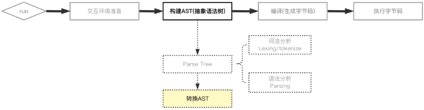

通过CPython提供的python标准库模块 `ast`，可以观察AST的生成。

同样观察 `a + 1` 这个表达式的处理过程：
```python
import ast
r_node = ast.parse("a + 1")
print(ast.dump(r_node))
```

得到：
```text
Module(
   body=[
      Expr(
         value=BinOp(
            left=Name(
               id='a',
               ctx=Load()
            ),
            op=Add(),
            right=Constant(
               value=1,
               kind=None
            )
         )
      )
   ],
   type_ignores=[]
)
```

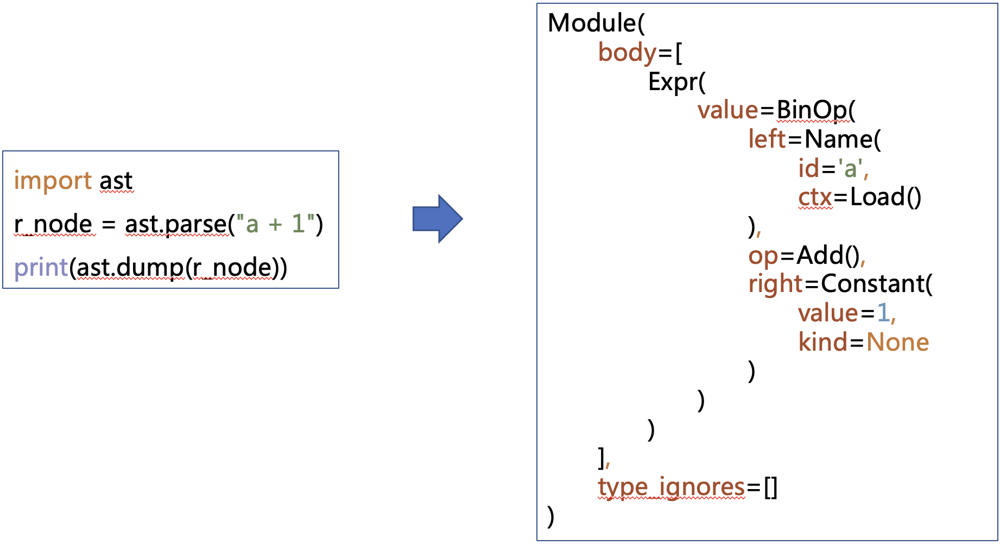

### 3.2 编译（生成字节码）

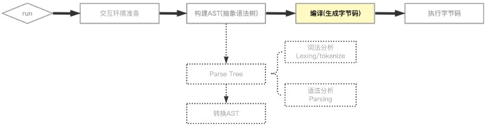

通过CPython提供的python标准库模块 `dis`，可以观察编译过程。

同样观察 `a + 1` 这个表达式的处理过程：
```python
import dis
dis.dis("a + 1")
```

得到：
```text
 1           0 LOAD_NAME                0 (a)
             2 LOAD_CONST               0 (1)
             4 BINARY_ADD
             6 RETURN_VALUE
```

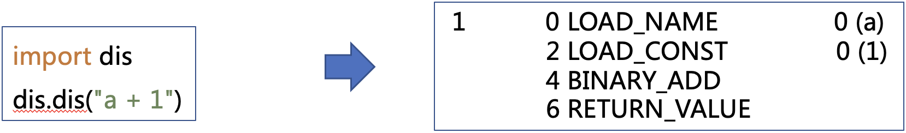

如果debug cpython源码，可以在函数 PyAST_CompileObject 的对象 co(PyCodeObject *) 中看到更多字节码信息：
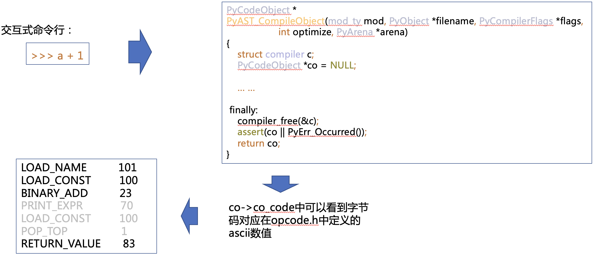
> *PyBytes_AsString(co->co_code)可以看到字节码对应在opcode.h中定义的ascii数值

### 3.3 执行字节码

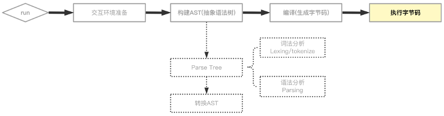

字节码最终会在文件 **Python/ceval.c** 中的函数 _`PyEval_EvalFrameDefault` 中执行；

其中的巨大for循环（main loop）会通过 `switch (opcode) - case TARGET(xxx)` 来分发字节码到具体执行逻辑中。

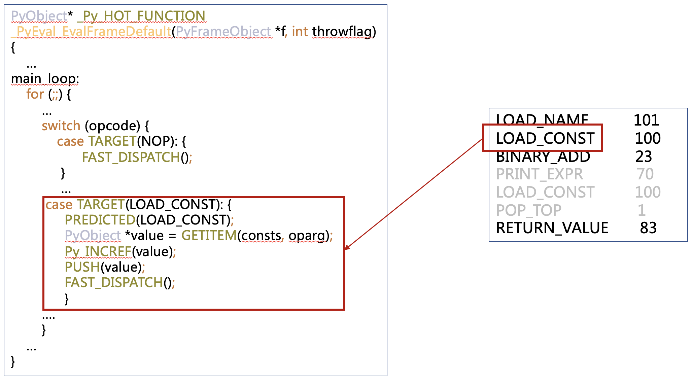
