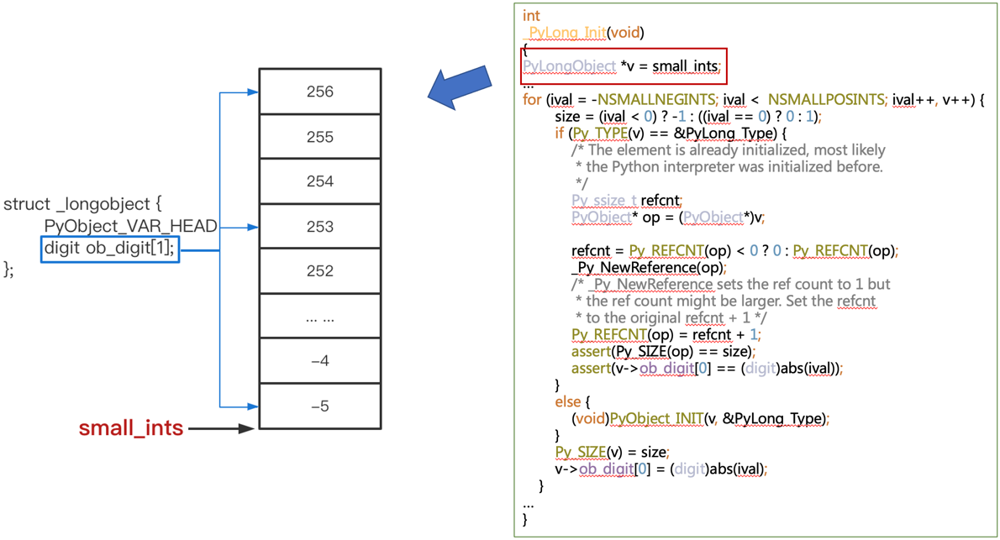

# small ints(小整数)

## 一个有趣的现象

在 python console 中输入：
```shell
>>> a = -5
>>> b = -5
>>> print(id(a), id(b))
4460004912 4460004912
```
a和b id相等，说明是**同一个对象**；
```shell
>>> c = -6
>>> d = -6
>>> print(id(c), id(d))
4463149184 4463150848
```
c和d id不相等，说明c和d是**不同对象**。

上面两个案例，为什么会有这种差异？
-- 这个要从python的内部实现来解释。

## 内部原理

当我们在python控制台输入命令：
```shell
>>> a = -5
```
然后回车时，cpython内部发生了一系列流程，来生成这个对象。

如下贴出了生成这个对象的调用栈：
```text
PyLong_FromLong longobject.c:335
parsenumber_raw ast.c:4634
parsenumber ast.c:4662
ast_for_atom ast.c:2462
ast_for_atom_expr ast.c:2814
ast_for_power ast.c:2850
ast_for_expr ast.c:3049
ast_for_factor ast.c:2772
ast_for_expr ast.c:3047
ast_for_testlist ast.c:3283
ast_for_expr_stmt ast.c:3473
ast_for_stmt ast.c:4553
PyAST_FromNodeObject ast.c:896
PyParser_ASTFromFileObject pythonrun.c:1462
PyRun_InteractiveOneObjectEx pythonrun.c:252
PyRun_InteractiveLoopFlags pythonrun.c:132
PyRun_AnyFileExFlags pythonrun.c:87
pymain_run_stdin main.c:547
pymain_run_python main.c:650
Py_RunMain main.c:729
pymain_main main.c:766
Py_BytesMain main.c:790
main python.c:16
start 0x00007fff2054cf3d
```
> 每行包含两部分内容：空格前面的第一部分是被调函数名；空格后面的第二部分是对应函数中，执行代码所在的文件和行号

关注当前调用栈最上层的函数 PyLong_FromLong：
```c
PyObject *
PyLong_FromLong(long ival)
{
    ...
    CHECK_SMALL_INT(ival);
    ...
```
CHECK_SMALL_INT 逻辑由宏定义：
```c
#define CHECK_SMALL_INT(ival)                               \
        do {                                                    \
            if (-NSMALLNEGINTS <= ival && ival < NSMALLPOSINTS) \
                return get_small_int((sdigit)ival);             \
        } while(0)
```
当目标int（对应本文开始例子中的-5或者-6等）处于 -NSMALLNEGINTS 和 NSMALLPOSINTS 范围中时，调用 get_small_int 函数来返回该整形对象：
```c
static PyObject *
get_small_int(sdigit ival)
{
    PyObject *v;
    ...
    v = (PyObject *)&small_ints[ival + NSMALLNEGINTS];
    ...
    return v;
}
```
可见，small_ints是预先定义的一个数组，该数组在python初始化阶段写入：
```c
int
_PyLong_Init(void)
{
PyLongObject *v = small_ints;
…
for (ival = -NSMALLNEGINTS; ival <  NSMALLPOSINTS; ival++, v++) {
        size = (ival < 0) ? -1 : ((ival == 0) ? 0 : 1);
        if (Py_TYPE(v) == &PyLong_Type) {
            /* The element is already initialized, most likely
             * the Python interpreter was initialized before.
             */
            Py_ssize_t refcnt;
            PyObject* op = (PyObject*)v;

            refcnt = Py_REFCNT(op) < 0 ? 0 : Py_REFCNT(op);
            _Py_NewReference(op);
            /* _Py_NewReference sets the ref count to 1 but
             * the ref count might be larger. Set the refcnt
             * to the original refcnt + 1 */
            Py_REFCNT(op) = refcnt + 1;
            assert(Py_SIZE(op) == size);
            assert(v->ob_digit[0] == (digit)abs(ival));
        }
        else {
            (void)PyObject_INIT(v, &PyLong_Type);
        }
        Py_SIZE(v) = size;
        v->ob_digit[0] = (digit)abs(ival);
    }
…
}
```

现在整体逻辑已经比较清晰了，python在初始化的过程中，预先定义并设置了一个整形数组 `small_ints`；后续当定义的数字处于该预定义范围中时，
直接从该数组中返回，否则重新生成一个整形对象。

NSMALLNEGINTS 和 NSMALLPOSINTS 通过宏定义：
```c
#define NSMALLPOSINTS           257
#define NSMALLNEGINTS           5
```
因此 -5 在该预定义的小整数范围中，而 -6 则不在，也就解释了本文一开始例子中的现象。

python运行初始化之后的`small_ints`示意如下图：


## 修改验证

将cpython3.8源码 Objects/longobject.c 的如下宏定义修改为：
```c
#define NSMALLNEGINTS           6
```
然后重新编译：
```shell
make -j8
```
> -j8表示使用8核进行编译以提升编译速度，根据实际硬件进行配置
> 
> 如果是第一次执行编译，需先进行配置后再执行该make命令：
> ```shell
> CPPFLAGS="-I$(brew --prefix zlib)/include" \
> LDFLAGS="-L$(brew --prefix zlib)/lib" \
> ./configure --with-openssl=$(brew --prefix openssl) --with-pydebug
> ```

重新进入python解释器验证：
```shell
>>> a = -6
>>> b = -6
>>> print(id(a), id(b))
4551161392 4551161392
```
可见，新的宏定义已经生效，-6 也被加入了python初始化阶段预定义的小整数池`small_ints`数组中。
